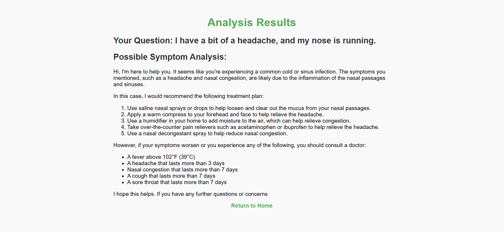

# Medical Q-A Robot
```csharp
// File Structure
Medical-Q-A-Robot/
├── main.py                // FastAPI main program
├── templates/             // HTML templates
│   ├── index.html         // User input page
│   └── result.html        // Result display page
├── static/                // Static files folder (optional)               
```

## Model Selection

- **Base Model**:  
  The base model used in this study is **Meta-Llama/Llama-3.2-1B-Instruct**, a pre-trained model designed for general-purpose language generation tasks.  

- **Fine-Tuning Datasets**:  
  The model was fine-tuned using two high-quality medical datasets to enhance its performance in medical Q&A tasks:  
  1. Keivalya/MedQuad-MedicalQnADataset
  2. Huzaifa525/Medical_Intelligence_Dataset_40k_Rows_of_Disease_Info_Treatments_and_Medical_QA

- **Final Fine-Tuned Model**:  
  The fine-tuned model is published under the name **Johhny1201/llama3.2_1b_med_QA_3** and is available for public use.

## User Interface
- **User input page**


- **Result display page**

